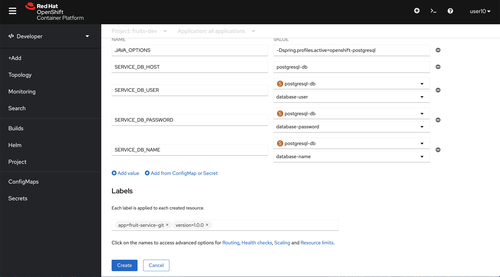

= Deployment of a sample Spring Boot Service in OpenShift using different techniques

We are going to deploy the same Spring Boot service in two different ways:

* Using a git repository as source for building a container image using Source to Image (S2I)
* Using JKube plugin, which in its turn will leverage also Source to Image (S2I)

Then we are going to use a Jenkins pipeline to promote the code from `DEV` to `TEST`.

Let's get started.

[#setting-environment]
== Setting the environment

Open a terminal window and set this two environment variables to hold the names of the `DEV` and `TEST` projects.

[source,sh]
----
export DEV_PROJECT=fruits-dev
export TEST_PROJECT=fruits-test
----

[NOTE]
========
If you run the demo before delete projects to start fresh.

[source,sh]
----
oc delete project ${DEV_PROJECT}
oc delete project ${TEST_PROJECT}
----
========

== Deploying our service from a git repository in OpenShift

Follow the next steps from the OpenShift web console.

Log in as a normal user in OCP web console.

Change to `DEVELOPER` view 

Create project ${DEV_PROJECT}

[#deploying-database]
=== Deploying the database

Let's add a database to our project. Click on the left side menu option `+Add` then on `Database` or directly on `Database` as in the next picture.

Start typing `postgre` in the search field to narrow down the options. Then click on `PostgreSQL` or `PostgreSQL (Ephemeral)` to open the template to deploy our database.

Now you should be seeing the documentation related to the template to deploy PostgreSQL. Please click on `Instantiate Template`

Time to fill in the details in the template form, please use these values and leave default values for the rest:

* *Database Service Name:* postgresql-db
* *PostgreSQL Connection Username:* luke
* *PostgreSQL Connection Password:* secret
* *PostgreSQL Database Name:* FRUITSDB

When done filling in the form click on `Create`.

After some seconds you should be seeing a Deployment object for our database progressing.

Let's make the deployment look better by adding a couple of labels.

[source,sh]
----
oc label dc/postgresql-db app.kubernetes.io/part-of=fruit-service-app --overwrite=true -n ${DEV_PROJECT} && \
oc label dc/postgresql-db app.openshift.io/runtime=postgresql --overwrite=true -n ${DEV_PROJECT}
----

[#deploying-code-from-git]
=== Deploying our code from Git

The code of our application is ready to be deployed against PostgreSQL and Oracle, this means we need to explicitly decide which `openshift` profile we have to use to build the image and also when running the code. This is the reason why we need to set `MAVEN_ARGS` withing the build configuration, in general you don't need to do this (also in general you don't change the backend database often, this is just sample code).

Let's get started, click on `+Add` as we did before then click on `From Git`.

Now you're in front of the deployment form `From Git`, the first thing is to fill in the git repo URL. Use this.

* *Git Repo URL:* https://github.com/atarazana/fruit-service-spring-boot

You will see that the URL is validated and Java language is detected (blue star icon). Leave the suggested `Build Image version` as is.

Scroll down and fill in the form with these values:

* *General Application:* fruit-service-app 
* *Name:* fruit-service-git

Select `Deployment` as the type of resource to generate.

Click on `Build configuration`, this exposes a sub-form to add environment variables. 

Click on `Add Value` and add an environment variable called *MAVEN_ARGS* with value *-Popenshift-postgresql*. When done click on `Deployment` we need to add some environment variables there to set up the runtime.

Use `Add value` option to add a couple of environment variables, use these pairs of name and value:

- *JAVA_OPTIONS:* -Dspring.profiles.active=openshift-postgresql
- *DB_HOST:* postgresql-db

Use `Add from ConfigMap or Secret` option to add some environment variables, use these pairs of name and value:

- DB_USER from secret postgresql-db...
- DB_PASSWORD from secret postgresql-db...
- DB_NAME from secret postgresql-db...

WARNING: When done, click on `Labels`

Add these labels, as in the next picture:

- app=fruit-service-git
- version=1.0.0

NOTE: After copying and pasting a label (the whole string including the `=` sign) click outside or press kbd:[TAB]

Click on `Create` to submit the form and trigger the deployment of our code.

After some seconds you should see the deployment progressing as in this picture.

Let's label the deployment to change the icon from Java to Spring and also to connect our deployment with the database. Please run this command to do so.

[source,sh]
----
oc label deployment/fruit-service-git app.openshift.io/runtime=spring --overwrite=true -n ${DEV_PROJECT} && \
oc annotate deployment/fruit-service-git app.openshift.io/connects-to=postgresql-db --overwrite=true -n ${DEV_PROJECT}
----

[#deploying-jenkins]
=== Deploying Jenkins

Change to `Developer` view if not done already, then click on `+Add` then select `From Catalog`.

Now click on the CI/CD then on the Jenkins icon.

Instantiate the template.

Leave default values except for these two, then click on `Create`:

* *Memory Limit:* 3Gi
* *Disable memory intensive administrative monitors:* true

Now from a terminal run this command to add the label to change the default icon with the Jenkins one.

[source,sh]
----
oc label dc/jenkins app.openshift.io/runtime=jenkins --overwrite=true -n ${DEV_PROJECT} 
----

[NOTE]
========
You could also deploy Jenkins with this command.

[source,sh]
----
oc new-app jenkins-ephemeral -p MEMORY_LIMIT=4Gi -p JENKINS_IMAGE_STREAM_TAG=jenkins:2 -n ${DEV_PROJECT}
oc label dc/jenkins app.openshift.io/runtime=jenkins --overwrite=true -n ${DEV_PROJECT} 
----
========

[#deploying-service-with-jkube]
=== Deploying our code using the JKube plugin

Maybe you want to run the code locally before you deploy the app.

[source,sh]
----
mvn clean spring-boot:run -Dspring-boot.run.profiles=local -Plocal
----

Now, imagine you feel confortable with your code and you want to deploy it, with `JKube` is as easy as running this command.

[source,sh]
----
oc project ${DEV_PROJECT}
mvn clean oc:deploy -DskipTests -Popenshift-postgresql
----

[#jenkins-pipeline]
== Jenkins Pipeline

[#prepare-target-environment]
=== Prepare target environment

Our target environment is a project we're going to name `${TEST_PROJECT}`. Run the next command to create our new project but set the previous one as default.

> You should have created ${DEV_PROJECT} manually before...

[source,sh]
----
oc new-project ${TEST_PROJECT}
oc project ${DEV_PROJECT}
----

*Deploy PostgreSQL DB in `${DEV_PROJECT}`*

> Skip this if done before before...

[source,sh]
----
oc new-app -e POSTGRESQL_USER=luke -ePOSTGRESQL_PASSWORD=secret -ePOSTGRESQL_DATABASE=FRUITSDB centos/postgresql-10-centos7 --as-deployment-config=true --name=postgresql-db -n ${DEV_PROJECT}
oc label dc/postgresql-db app.kubernetes.io/part-of=fruit-service-app -n ${DEV_PROJECT} && \
oc label dc/postgresql-db app.openshift.io/runtime=postgresql --overwrite=true -n ${DEV_PROJECT} 
----

*Deploy PostgreSQL DB in `${TEST_PROJECT}`*

[source,sh]
----
oc new-app -e POSTGRESQL_USER=luke -ePOSTGRESQL_PASSWORD=secret -ePOSTGRESQL_DATABASE=FRUITSDB centos/postgresql-10-centos7 --as-deployment-config=true --name=postgresql-db -n ${TEST_PROJECT}
oc label dc/postgresql-db app.kubernetes.io/part-of=fruit-service-app -n ${TEST_PROJECT} && \
oc label dc/postgresql-db app.openshift.io/runtime=postgresql --overwrite=true -n ${TEST_PROJECT} 
----

Set correct permissions to Jenkins Service Account on DEV and TEST projects and also set permissions to default Service Account in TEST so that it can pull images from DEV project.

[source,sh]
----
oc policy add-role-to-user edit system:serviceaccount:${DEV_PROJECT}:jenkins -n ${TEST_PROJECT} && \
oc policy add-role-to-user view system:serviceaccount:${DEV_PROJECT}:jenkins -n ${TEST_PROJECT} && \
oc policy add-role-to-user system:image-puller system:serviceaccount:${TEST_PROJECT}:default -n ${DEV_PROJECT}
----

[#create-pipeline]
=== Create Pipeline in DEV project

We need to deploy our Jenkins pipeline where Jenkis was deployed, in this case in `${DEV_PROJECT}`.

[source,sh]
----
oc apply -n ${DEV_PROJECT} -f jenkins-pipeline-complex.yaml
----

[#start-pipeline]
=== Start the pipeline

[source,sh]
----
oc start-build bc/fruit-service-pipeline-complex --env=DEV_PROJECT_NAME=${DEV_PROJECT} --env=TEST_PROJECT_NAME=${TEST_PROJECT} -n ${DEV_PROJECT}
----

If database is oracle then:

[source,sh]
----
oc start-build bc/fruit-service-pipeline-complex --env=DEV_PROJECT_NAME=${DEV_PROJECT} --env=TEST_PROJECT_NAME=${TEST_PROJECT} --env=ACTIVE_PROFILE=openshift-oracle -n ${DEV_PROJECT}
----

[#start-pipeline-proxy]
=== Start the pipeline if your behind a proxy

[source,sh]
----
export HTTP_PROXY_HOST=10.2.0.40
export HTTP_PROXY_PORT=3128
export HTTPS_PROXY_HOST=10.2.0.40
export HTTPS_PROXY_PORT=3128

export KUBERNETES_HOST=172.30.0.1

export NO_PROXY="${KUBERNETES_HOST},.cluster.local,.svc,10.0.0.0/16,10.128.0.0/14,10.2.10.0/28,127.0.0.1,172.30.0.0/16,api-int.ocp4.dcst.cartasi.local,dcst.cartasi.local,etcd-0.ocp4.dcst.cartasi.local,etcd-1.ocp4.dcst.cartasi.local,etcd-2.ocp4.dcst.cartasi.local,localhost"

export NON_PROXY_HOSTS=$(echo ${NO_PROXY} | sed -e 's/,/|/g')

export MAVEN_OPTS_BASE="-Dsun.zip.disableMemoryMapping=true -Xms20m -Djava.security.egd=file:/dev/./urandom -XX:+UnlockExperimentalVMOptions -Dsun.zip.disableMemoryMapping=true"

export MAVEN_OPTS="${MAVEN_OPTS_BASE} -Dhttp.proxyHost=${HTTP_PROXY_HOST} -Dhttp.proxyPort=${HTTP_PROXY_PORT} -Dhttps.proxyHost=${HTTPS_PROXY_HOST} -Dhttps.proxyPort=${HTTPS_PROXY_PORT} -Dhttp.nonProxyHosts=\"${NON_PROXY_HOSTS}\""

oc start-build bc/fruit-service-pipeline-complex \
  --env=DEV_PROJECT_NAME=${DEV_PROJECT} --env=TEST_PROJECT_NAME=${TEST_PROJECT} \
  --env=HTTP_PROXY="http://${HTTP_PROXY_HOST}:${HTTP_PROXY_PORT}" \
  --env=HTTPS_PROXY="http://${HTTPS_PROXY_HOST}:${HTTPS_PROXY_PORT}" \
  --env=NO_PROXY="${NO_PROXY}" \
  --env=MAVEN_OPTS="${MAVEN_OPTS}" \
  -n ${DEV_PROJECT}
----

[#troubleshooting-pipelines]
=== Troubleshooting Pipelines

[source,sh]
----
oc import-image jenkins-alt:4.3.26 --from=registry.redhat.io/openshift4/ose-jenkins:v4.3.26 --confirm --scheduled=true -n openshift
----

[source,sh]
----
oc import-image jenkins-alt:4.3.26 --from=registry.redhat.io/openshift4/ose-jenkins:v4.3.26 --confirm --scheduled=true -n openshift
oc new-app jenkins-ephemeral -p MEMORY_LIMIT=3Gi -p JENKINS_IMAGE_STREAM_TAG=jenkins-alt:4.3.26 -n ${DEV_PROJECT}
----

